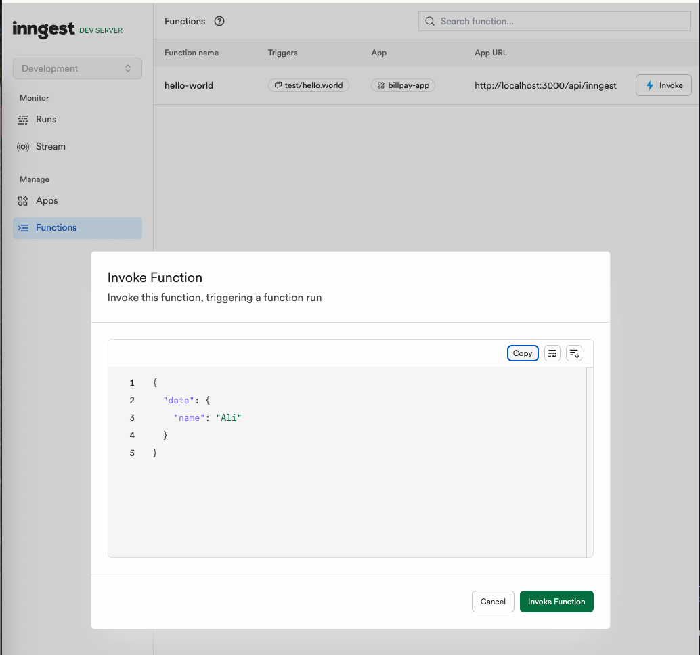

# Inngest POC - Hello World Function

This is a working proof-of-concept [Next.js](https://nextjs.org) project with [Inngest](https://inngest.com) integration to help you get started with Inngest functions.

## Quick Start

Follow these steps to get the project running:

### 1. Clone and Install Dependencies

```bash
git clone git@github.com:dubscode/inngest-guide.git
cd inngest-guide
npm install
```

### 2. Start the Development Servers

You'll need **two terminals** running simultaneously:

**Terminal 1 - Start Next.js development server:**
```bash
npm run dev
```

**Terminal 2 - Start Inngest development server:**
```bash
npm run inngest
```

### 3. Access the Inngest Dashboard

Once both servers are running, open your browser and navigate to:
```
http://localhost:8288/functions
```

You should see the Inngest development dashboard with your `hello-world` function listed.

### 4. Test the Function

There are two ways to test the `hello-world` function:

#### Option A: Manual Invoke (via Dashboard)

Click the "Invoke" button next to the `hello-world` function and use this payload:

```json
{
  "data": {
    "name": "Ali"
  }
}
```



#### Option B: Programmatic Trigger (via API)

Use curl to trigger the function from code:

```bash
curl -X POST http://localhost:3000/api/hello
```

This will:
1. Send a POST request to your Next.js API route
2. The API route will trigger the Inngest function with the event `test/hello.world`
3. Return `{ "message": "Event sent!" }`
4. You can see the function execution in the Inngest dashboard

Both methods will result in the function:
1. Waiting for 5 seconds (demonstrating Inngest's step functionality)
2. Returning a personalized greeting: `"Hello Ali!"`

## What's Included

- **Next.js App**: Basic Next.js application with App Router
- **Inngest Function**: A simple `hello-world` function that demonstrates:
  - Event-driven execution
  - Step functions (with a 5-second sleep)
  - Data processing from event payload
- **API Routes**: 
  - `/api/inngest` - Inngest webhook endpoint
  - `/api/hello` - Example route that triggers Inngest functions

## Project Structure

```
src/
├── app/
│   └── api/
│       ├── hello/            # Example API route that triggers functions
│       └── inngest/          # Inngest webhook endpoint
└── inngest/
    ├── client.ts             # Inngest client configuration
    └── functions.ts          # Your Inngest functions
```

## Next Steps

This POC demonstrates the basics of Inngest. You can:
- Add more functions to `src/inngest/functions.ts`
- Trigger functions from your Next.js application
- Explore Inngest's step functions, retries, and scheduling features
- Deploy to production with your preferred hosting platform

## Learn More

- [Inngest Documentation](https://inngest.com/docs)
- [Next.js Documentation](https://nextjs.org/docs)
- [Inngest Examples](https://github.com/inngest/inngest-js/tree/main/examples)
